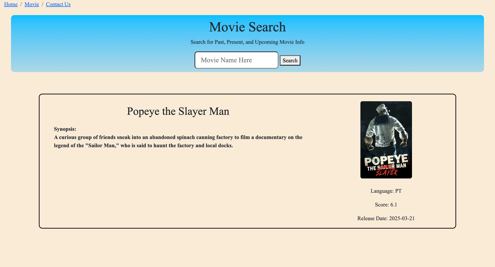
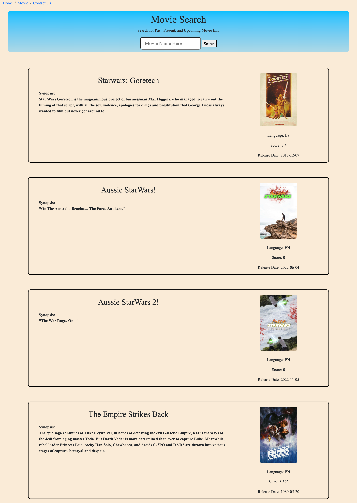
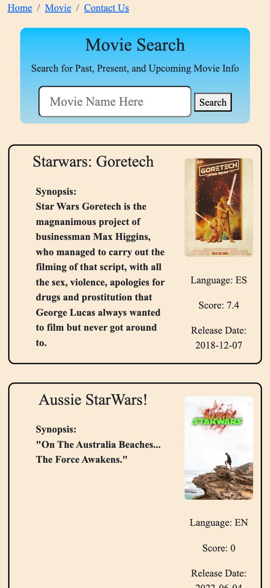

# Movie Search Project README
## Table of contents

- [Overview](#overview)
  - [Links](#links)
  - [Contributers](#contributers)
  - [Introduction](#introduction)
  - [User Story](#user-story)
  - [Technology](#technology)
- [Features](#features)
  - [Homepage](#homepage)
  - [Search](#search)
- [Screenshot](#screenshot)
## Links
- GitHub Repository: https://github.com/EnzoTragnone/Movie-Search

- Live page: https://enzotragnone.github.io/Movie-Search/

## Contributers 
- This was a group project collaberation:
- Enzo Tragnone (GitHub link: https://github.com/EnzoTragnone)
- Longyang Wang (GitHub link: https://github.com/YangLongWang)
- Omar Rodriguez (GitHub link: https://github.com/nickless192)
- Daniel Rubino (GitHub link: https://github.com/RubinoD1)

## Introduction 
 Why did you build this project?

- The idea behind the project was to provide a central location where movie/tv show information and availability  could be attained by the user. 

 What problem does it solve?

- The site eliminates the need to make extra searches for streaming availability, trailers, movie info, and now playing information for theatres. 

 What did you learn?

Workflow

- Meeting daily and regularly communicating with team members allowed for the project to progress at a steady pace. Team members kept each other informed as to what they were working on and in which branch. This was key, as it avoided overlap in what we were working on and allowed us to identify areas that needed to be taken care of so work could progress at a consistent pace. 

- The work was distributed so that everyone had their own tasks each day to work on, allowing for a very productive development of the site. Daily meetings and messages over the app 'Slack' allowed everyone to stay informed about how development was progressing and allowed for a dynamic workflow as the project developed. Knowing what features we were to be working on and staying up-to-date on the progress that others were making was key to our success as a team. 

Using GitHub for projects 

- Kanban board: The kanban board acts similar to creating pseudo-code, in that both create an outline of what needs to be done on a project. The kanban board is a convenient way for groups to manage and check what work needs to be done, and who is assigned to the task. Creating and making use of this feature on GitHub, in the projects tab, allowed for a convenient central location to manage the progress of the project and allowed members to make additions for emerging work tasks. Making use of this feature proved to be an organizational asset to the project and implementing its use for solo works would be a benefit as it is easy to use and allows for clear organization of workflow.   

- Creating / Using issues feature: The issues section acts like a message board within a repository. It allows comments to be made for specific issues and for team members to be assigned or self-assigned specific issues. The tags are useful for clarity on what an issue is pertaining to, and in general is a convenient way for team members to see areas of a project that need to be worked on in conjunction with the kanban board.  
 
- Working in branches: A develop branch was created and branches were created for the development of the sites features. Once a feature was ready to be pushed, a pull request was made to be merged with the develop branch. Once testing was passed on the develop branch, then it was merged with the main branch. This insured that the main branch remained intact and avoided time loss in having to revert back to a previous build. Working in seperate branches also had the benefit of allowing us to be able to merge specific changes in a controlled setting.  
 

## User Story
- As a movie lover, I want to be able to look up information about a movie and be provided with key information about that title and its availability. 

## Technology 

- Html, Js, Css
- Bootstrap
- Server-side APIs

## Features

### Homepage

- Now showing movies: The homepage on load displays a list of now playing movies with their title and movie poster. On clicking one of the now playing movies a search is triggered and more detailed information about that title is presented to the user. 

- Quick navigation tabs: The homepage has three tabs: home, movie, and contact us. These tabs allow the user to quickly navigate to their desired section of the site without having to scroll to reach it. 

- Contact us section: The page's footer holds links to the project collaborators GitHub pages. GitHub profile icons were used in this section. 

### Search 

- Movie Information: Movie title, IMDB score, release date, language are provided on the top of the movie information section. A movie synopsis and movie poster are provided to the user. 

- IMDB reviews: A limited selection of reviews from the IMDB website can be displayed on the page if the user wishes to see this information. These reviews also contain the username of the reviewer, and the score they gave the movie. 

## Screenshot

